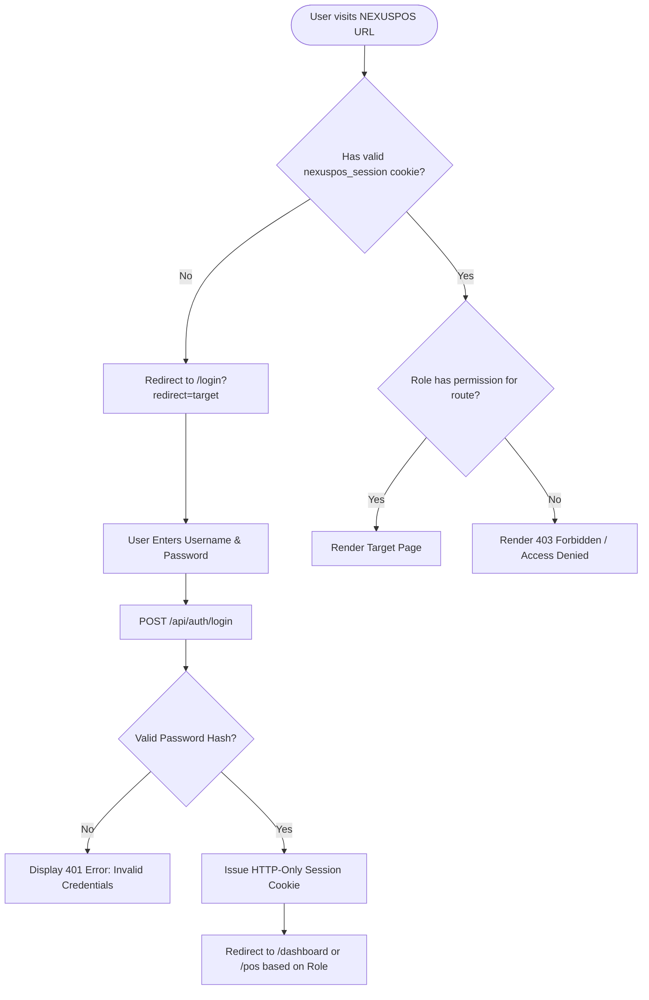
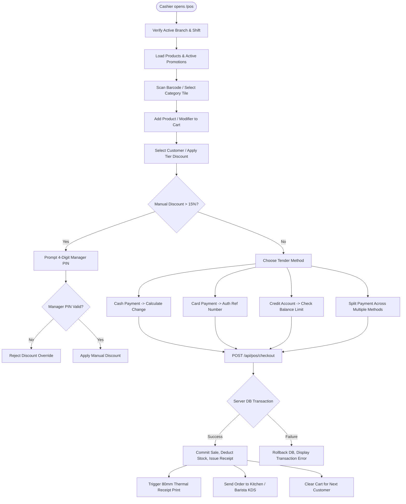
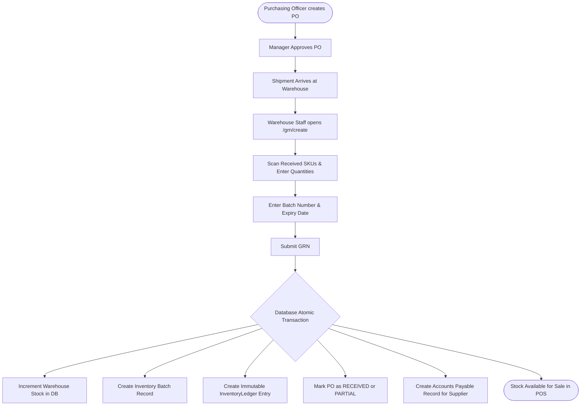
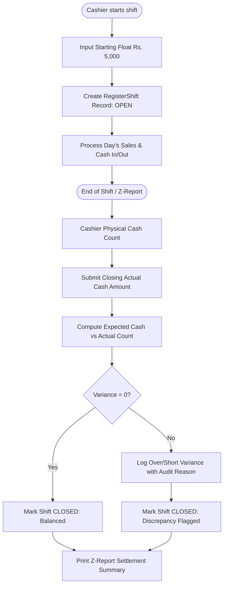

# NEXUSPOS Application Flow & Operational State Diagrams

**Document Version:** 1.0.0  
**Target Workflows:** Auth, POS Sales, Inventory Transfers, Purchasing, Returns, Shift Closing, and Payroll.

---

## 1. Authentication & Route Guard Flow

---

## 2. Frontline POS Checkout & Split Payment Flow

---

## 3. Inventory Receiving (GRN) & Stock Movement Flow

---

## 4. Cashier Shift Reconciliation & Drawer Closing

