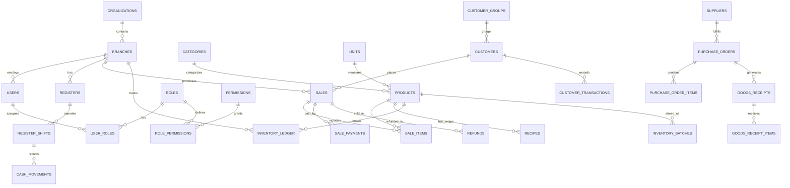

# NEXUSPOS Relational Database Schema & Data Architecture

**Engine:** PostgreSQL 15+ / 16+  
**Schema Version:** 1.0.0  
**Design Standards:** Normalized 3NF, UUID / BigInt Primary Keys, Foreign Key Constraints, Audit Timestamps, Soft Deletes (`deleted_at`), Decimal-Safe Currency (`NUMERIC(12, 2)`).

---

## 1. Entity Relationship Overview



---

## 2. Core Relational Tables (SQL DDL)

### 2.1 Multi-Tenant & Organization Layer
```sql
-- 1. Organizations (Top-level multi-tenant container)
CREATE TABLE organizations (
    id SERIAL PRIMARY KEY,
    code VARCHAR(50) UNIQUE NOT NULL,
    name VARCHAR(255) NOT NULL,
    tax_number VARCHAR(100),
    currency_code VARCHAR(10) DEFAULT 'LKR',
    currency_symbol VARCHAR(10) DEFAULT 'Rs.',
    is_active BOOLEAN DEFAULT TRUE,
    created_at TIMESTAMPTZ DEFAULT NOW(),
    updated_at TIMESTAMPTZ DEFAULT NOW()
);

-- 2. Branches / Outlets
CREATE TABLE branches (
    id SERIAL PRIMARY KEY,
    org_id INT NOT NULL REFERENCES organizations(id) ON DELETE CASCADE,
    code VARCHAR(50) NOT NULL,
    name VARCHAR(255) NOT NULL,
    address TEXT,
    phone VARCHAR(50),
    email VARCHAR(100),
    is_active BOOLEAN DEFAULT TRUE,
    created_at TIMESTAMPTZ DEFAULT NOW(),
    updated_at TIMESTAMPTZ DEFAULT NOW(),
    UNIQUE(org_id, code)
);
```

### 2.2 RBAC & Authentication Tables
```sql
-- 3. Users
CREATE TABLE users (
    id SERIAL PRIMARY KEY,
    org_id INT NOT NULL REFERENCES organizations(id) ON DELETE CASCADE,
    branch_id INT REFERENCES branches(id) ON DELETE SET NULL,
    username VARCHAR(100) NOT NULL,
    email VARCHAR(255),
    name VARCHAR(255) NOT NULL,
    password_hash VARCHAR(255) NOT NULL,
    pin_code_hash VARCHAR(255), -- 4-digit manager authorization PIN
    role VARCHAR(50) NOT NULL DEFAULT 'CASHIER',
    must_change_password BOOLEAN DEFAULT FALSE,
    is_active BOOLEAN DEFAULT TRUE,
    last_login_at TIMESTAMPTZ,
    created_at TIMESTAMPTZ DEFAULT NOW(),
    updated_at TIMESTAMPTZ DEFAULT NOW(),
    deleted_at TIMESTAMPTZ,
    UNIQUE(org_id, username)
);

-- 4. Sessions
CREATE TABLE user_sessions (
    id VARCHAR(128) PRIMARY KEY,
    user_id INT NOT NULL REFERENCES users(id) ON DELETE CASCADE,
    ip_address VARCHAR(45),
    user_agent TEXT,
    expires_at TIMESTAMPTZ NOT NULL,
    created_at TIMESTAMPTZ DEFAULT NOW()
);

-- 5. Permissions & Roles
CREATE TABLE permissions (
    id SERIAL PRIMARY KEY,
    code VARCHAR(100) UNIQUE NOT NULL,
    description TEXT,
    module VARCHAR(50) NOT NULL
);

CREATE TABLE roles (
    id SERIAL PRIMARY KEY,
    org_id INT NOT NULL REFERENCES organizations(id) ON DELETE CASCADE,
    name VARCHAR(100) NOT NULL,
    description TEXT,
    created_at TIMESTAMPTZ DEFAULT NOW(),
    UNIQUE(org_id, name)
);

CREATE TABLE role_permissions (
    role_id INT NOT NULL REFERENCES roles(id) ON DELETE CASCADE,
    permission_id INT NOT NULL REFERENCES permissions(id) ON DELETE CASCADE,
    PRIMARY KEY(role_id, permission_id)
);
```

### 2.3 Product Catalog, Units & Recipes
```sql
-- 6. Categories & Units
CREATE TABLE categories (
    id SERIAL PRIMARY KEY,
    org_id INT NOT NULL REFERENCES organizations(id) ON DELETE CASCADE,
    name VARCHAR(100) NOT NULL,
    description TEXT,
    parent_id INT REFERENCES categories(id) ON DELETE SET NULL,
    created_at TIMESTAMPTZ DEFAULT NOW(),
    UNIQUE(org_id, name)
);

CREATE TABLE units (
    id SERIAL PRIMARY KEY,
    org_id INT NOT NULL REFERENCES organizations(id) ON DELETE CASCADE,
    name VARCHAR(50) NOT NULL,
    abbreviation VARCHAR(20) NOT NULL,
    created_at TIMESTAMPTZ DEFAULT NOW(),
    UNIQUE(org_id, abbreviation)
);

-- 7. Products
CREATE TABLE products (
    id SERIAL PRIMARY KEY,
    org_id INT NOT NULL REFERENCES organizations(id) ON DELETE CASCADE,
    sku VARCHAR(100) NOT NULL,
    barcode VARCHAR(100),
    name VARCHAR(255) NOT NULL,
    description TEXT,
    category_id INT REFERENCES categories(id) ON DELETE SET NULL,
    unit_id INT REFERENCES units(id) ON DELETE SET NULL,
    cost_price NUMERIC(12, 2) NOT NULL DEFAULT 0.00,
    retail_price NUMERIC(12, 2) NOT NULL DEFAULT 0.00,
    wholesale_price NUMERIC(12, 2) DEFAULT 0.00,
    pickme_price NUMERIC(12, 2) DEFAULT 0.00,
    uber_price NUMERIC(12, 2) DEFAULT 0.00,
    is_recipe_based BOOLEAN DEFAULT FALSE,
    track_inventory BOOLEAN DEFAULT TRUE,
    reorder_level INT DEFAULT 10,
    image_url TEXT,
    is_active BOOLEAN DEFAULT TRUE,
    created_at TIMESTAMPTZ DEFAULT NOW(),
    updated_at TIMESTAMPTZ DEFAULT NOW(),
    deleted_at TIMESTAMPTZ,
    UNIQUE(org_id, sku)
);

-- 8. Raw Materials & Recipes (BOM)
CREATE TABLE raw_materials (
    id SERIAL PRIMARY KEY,
    org_id INT NOT NULL REFERENCES organizations(id) ON DELETE CASCADE,
    code VARCHAR(100) NOT NULL,
    name VARCHAR(255) NOT NULL,
    unit_id INT NOT NULL REFERENCES units(id),
    cost_per_unit NUMERIC(12, 2) NOT NULL DEFAULT 0.00,
    reorder_level INT DEFAULT 10,
    created_at TIMESTAMPTZ DEFAULT NOW(),
    UNIQUE(org_id, code)
);

CREATE TABLE recipes (
    id SERIAL PRIMARY KEY,
    product_id INT NOT NULL REFERENCES products(id) ON DELETE CASCADE,
    name VARCHAR(255) NOT NULL,
    yield_quantity NUMERIC(10, 2) DEFAULT 1.00,
    instructions TEXT,
    is_active BOOLEAN DEFAULT TRUE,
    created_at TIMESTAMPTZ DEFAULT NOW()
);

CREATE TABLE recipe_items (
    id SERIAL PRIMARY KEY,
    recipe_id INT NOT NULL REFERENCES recipes(id) ON DELETE CASCADE,
    raw_material_id INT NOT NULL REFERENCES raw_materials(id) ON DELETE RESTRICT,
    quantity NUMERIC(10, 4) NOT NULL,
    unit_id INT NOT NULL REFERENCES units(id)
);
```

### 2.4 Immutable Inventory Ledger & Batches
```sql
-- 9. Warehouses
CREATE TABLE warehouses (
    id SERIAL PRIMARY KEY,
    org_id INT NOT NULL REFERENCES organizations(id) ON DELETE CASCADE,
    branch_id INT REFERENCES branches(id) ON DELETE CASCADE,
    code VARCHAR(50) NOT NULL,
    name VARCHAR(255) NOT NULL,
    location TEXT,
    is_active BOOLEAN DEFAULT TRUE,
    created_at TIMESTAMPTZ DEFAULT NOW()
);

-- 10. Immutable Inventory Ledger
CREATE TABLE inventory_ledger (
    id BIGSERIAL PRIMARY KEY,
    org_id INT NOT NULL REFERENCES organizations(id) ON DELETE CASCADE,
    branch_id INT NOT NULL REFERENCES branches(id) ON DELETE CASCADE,
    warehouse_id INT REFERENCES warehouses(id),
    product_id INT REFERENCES products(id) ON DELETE CASCADE,
    raw_material_id INT REFERENCES raw_materials(id) ON DELETE CASCADE,
    movement_type VARCHAR(50) NOT NULL, -- 'OPENING', 'SALE', 'PURCHASE_RECEIPT', 'SALE_RETURN', 'SUPPLIER_RETURN', 'ADJUSTMENT', 'TRANSFER_IN', 'TRANSFER_OUT', 'WASTAGE', 'PRODUCTION_CONSUMED', 'PRODUCTION_YIELD'
    quantity NUMERIC(12, 4) NOT NULL, -- Positive for in, Negative for out
    unit_cost NUMERIC(12, 2) NOT NULL DEFAULT 0.00,
    previous_stock NUMERIC(12, 4) NOT NULL,
    new_stock NUMERIC(12, 4) NOT NULL,
    reference_type VARCHAR(50), -- 'SALE', 'GRN', 'RETURN', 'TRANSFER', 'ADJUSTMENT'
    reference_id VARCHAR(100),
    user_id INT REFERENCES users(id) ON DELETE SET NULL,
    notes TEXT,
    created_at TIMESTAMPTZ DEFAULT NOW()
);

CREATE INDEX idx_inv_ledger_product ON inventory_ledger(branch_id, product_id, created_at DESC);
CREATE INDEX idx_inv_ledger_raw_mat ON inventory_ledger(branch_id, raw_material_id, created_at DESC);

-- 11. Batches & Expiry Records
CREATE TABLE inventory_batches (
    id SERIAL PRIMARY KEY,
    org_id INT NOT NULL REFERENCES organizations(id) ON DELETE CASCADE,
    branch_id INT NOT NULL REFERENCES branches(id) ON DELETE CASCADE,
    product_id INT REFERENCES products(id),
    raw_material_id INT REFERENCES raw_materials(id),
    batch_number VARCHAR(100) NOT NULL,
    quantity NUMERIC(12, 4) NOT NULL,
    unit_cost NUMERIC(12, 2) NOT NULL,
    manufacturing_date DATE,
    expiry_date DATE,
    created_at TIMESTAMPTZ DEFAULT NOW()
);
```

### 2.5 Sales, Transactions, Registers & Refunds
```sql
-- 12. Dining Tables & VIP Rooms
CREATE TABLE dining_tables (
    id SERIAL PRIMARY KEY,
    branch_id INT NOT NULL REFERENCES branches(id) ON DELETE CASCADE,
    table_number VARCHAR(50) NOT NULL,
    name VARCHAR(100) NOT NULL,
    capacity INT DEFAULT 4,
    status VARCHAR(50) DEFAULT 'AVAILABLE', -- 'AVAILABLE', 'OCCUPIED', 'RESERVED', 'CLEANING'
    created_at TIMESTAMPTZ DEFAULT NOW(),
    UNIQUE(branch_id, table_number)
);

-- 13. Registers & Register Shifts
CREATE TABLE registers (
    id SERIAL PRIMARY KEY,
    branch_id INT NOT NULL REFERENCES branches(id) ON DELETE CASCADE,
    name VARCHAR(100) NOT NULL,
    code VARCHAR(50) NOT NULL,
    is_active BOOLEAN DEFAULT TRUE,
    created_at TIMESTAMPTZ DEFAULT NOW()
);

CREATE TABLE register_shifts (
    id SERIAL PRIMARY KEY,
    register_id INT NOT NULL REFERENCES registers(id) ON DELETE CASCADE,
    user_id INT NOT NULL REFERENCES users(id) ON DELETE RESTRICT,
    opening_float NUMERIC(12, 2) NOT NULL DEFAULT 0.00,
    closing_cash_actual NUMERIC(12, 2),
    expected_cash NUMERIC(12, 2),
    cash_variance NUMERIC(12, 2),
    opened_at TIMESTAMPTZ DEFAULT NOW(),
    closed_at TIMESTAMPTZ,
    status VARCHAR(50) DEFAULT 'OPEN' -- 'OPEN', 'CLOSED'
);

-- 14. Sales Master Table
CREATE TABLE sales (
    id SERIAL PRIMARY KEY,
    org_id INT NOT NULL REFERENCES organizations(id) ON DELETE CASCADE,
    branch_id INT NOT NULL REFERENCES branches(id) ON DELETE CASCADE,
    register_shift_id INT REFERENCES register_shifts(id),
    order_no VARCHAR(100) NOT NULL,
    user_id INT NOT NULL REFERENCES users(id),
    customer_id INT REFERENCES customers(id) ON DELETE SET NULL,
    table_id INT REFERENCES dining_tables(id) ON DELETE SET NULL,
    order_type VARCHAR(50) NOT NULL DEFAULT 'DINE_IN', -- 'DINE_IN', 'TAKEAWAY', 'DELIVERY', 'PICKME', 'UBER_EATS'
    subtotal NUMERIC(12, 2) NOT NULL DEFAULT 0.00,
    discount_amount NUMERIC(12, 2) NOT NULL DEFAULT 0.00,
    discount_type VARCHAR(50),
    discount_rate NUMERIC(5, 2) DEFAULT 0.00,
    tax_amount NUMERIC(12, 2) NOT NULL DEFAULT 0.00,
    service_charge NUMERIC(12, 2) NOT NULL DEFAULT 0.00,
    total_amount NUMERIC(12, 2) NOT NULL DEFAULT 0.00,
    payment_status VARCHAR(50) DEFAULT 'PAID', -- 'PAID', 'PARTIALLY_PAID', 'PENDING', 'VOIDED', 'REFUNDED'
    status VARCHAR(50) DEFAULT 'COMPLETED', -- 'COMPLETED', 'HOLD', 'VOIDED', 'CANCELLED'
    void_reason TEXT,
    voided_by INT REFERENCES users(id),
    created_at TIMESTAMPTZ DEFAULT NOW(),
    updated_at TIMESTAMPTZ DEFAULT NOW(),
    UNIQUE(org_id, order_no)
);

CREATE INDEX idx_sales_branch_date ON sales(branch_id, created_at DESC);

-- 15. Sale Items
CREATE TABLE sale_items (
    id SERIAL PRIMARY KEY,
    sale_id INT NOT NULL REFERENCES sales(id) ON DELETE CASCADE,
    product_id INT NOT NULL REFERENCES products(id) ON DELETE RESTRICT,
    quantity NUMERIC(10, 2) NOT NULL,
    unit_price NUMERIC(12, 2) NOT NULL,
    cost_price NUMERIC(12, 2) NOT NULL DEFAULT 0.00,
    discount_amount NUMERIC(12, 2) DEFAULT 0.00,
    tax_amount NUMERIC(12, 2) DEFAULT 0.00,
    line_total NUMERIC(12, 2) NOT NULL,
    notes TEXT
);

-- 16. Sale Payments
CREATE TABLE sale_payments (
    id SERIAL PRIMARY KEY,
    sale_id INT NOT NULL REFERENCES sales(id) ON DELETE CASCADE,
    payment_method VARCHAR(50) NOT NULL, -- 'CASH', 'CARD', 'CREDIT', 'QR_DIGITAL', 'PICKME', 'UBER'
    amount NUMERIC(12, 2) NOT NULL,
    tendered_amount NUMERIC(12, 2),
    change_amount NUMERIC(12, 2),
    reference_no VARCHAR(100),
    created_at TIMESTAMPTZ DEFAULT NOW()
);
```

### 2.6 Customers, Suppliers, Purchasing & Returns
```sql
-- 17. Customers & Customer Groups
CREATE TABLE customer_groups (
    id SERIAL PRIMARY KEY,
    org_id INT NOT NULL REFERENCES organizations(id) ON DELETE CASCADE,
    name VARCHAR(100) NOT NULL,
    discount_percentage NUMERIC(5, 2) DEFAULT 0.00,
    created_at TIMESTAMPTZ DEFAULT NOW()
);

CREATE TABLE customers (
    id SERIAL PRIMARY KEY,
    org_id INT NOT NULL REFERENCES organizations(id) ON DELETE CASCADE,
    group_id INT REFERENCES customer_groups(id) ON DELETE SET NULL,
    code VARCHAR(50) NOT NULL,
    name VARCHAR(255) NOT NULL,
    phone VARCHAR(50),
    email VARCHAR(100),
    address TEXT,
    credit_limit NUMERIC(12, 2) DEFAULT 0.00,
    outstanding_balance NUMERIC(12, 2) DEFAULT 0.00,
    loyalty_points INT DEFAULT 0,
    is_active BOOLEAN DEFAULT TRUE,
    created_at TIMESTAMPTZ DEFAULT NOW(),
    UNIQUE(org_id, code)
);

-- 18. Suppliers & Purchasing
CREATE TABLE suppliers (
    id SERIAL PRIMARY KEY,
    org_id INT NOT NULL REFERENCES organizations(id) ON DELETE CASCADE,
    code VARCHAR(50) NOT NULL,
    name VARCHAR(255) NOT NULL,
    contact_person VARCHAR(100),
    phone VARCHAR(50),
    email VARCHAR(100),
    address TEXT,
    credit_period_days INT DEFAULT 30,
    outstanding_balance NUMERIC(12, 2) DEFAULT 0.00,
    is_active BOOLEAN DEFAULT TRUE,
    created_at TIMESTAMPTZ DEFAULT NOW(),
    UNIQUE(org_id, code)
);

CREATE TABLE purchase_orders (
    id SERIAL PRIMARY KEY,
    org_id INT NOT NULL REFERENCES organizations(id) ON DELETE CASCADE,
    branch_id INT NOT NULL REFERENCES branches(id) ON DELETE CASCADE,
    supplier_id INT NOT NULL REFERENCES suppliers(id) ON DELETE RESTRICT,
    po_number VARCHAR(100) NOT NULL,
    expected_delivery_date DATE,
    subtotal NUMERIC(12, 2) NOT NULL DEFAULT 0.00,
    tax_amount NUMERIC(12, 2) DEFAULT 0.00,
    total_amount NUMERIC(12, 2) NOT NULL DEFAULT 0.00,
    status VARCHAR(50) DEFAULT 'DRAFT', -- 'DRAFT', 'APPROVED', 'RECEIVED', 'PARTIALLY_RECEIVED', 'CANCELLED'
    created_by INT REFERENCES users(id),
    created_at TIMESTAMPTZ DEFAULT NOW(),
    UNIQUE(org_id, po_number)
);

CREATE TABLE goods_receipts (
    id SERIAL PRIMARY KEY,
    org_id INT NOT NULL REFERENCES organizations(id) ON DELETE CASCADE,
    branch_id INT NOT NULL REFERENCES branches(id) ON DELETE CASCADE,
    supplier_id INT NOT NULL REFERENCES suppliers(id) ON DELETE RESTRICT,
    purchase_order_id INT REFERENCES purchase_orders(id),
    grn_number VARCHAR(100) NOT NULL,
    supplier_invoice_no VARCHAR(100),
    invoice_amount NUMERIC(12, 2) NOT NULL DEFAULT 0.00,
    paid_amount NUMERIC(12, 2) DEFAULT 0.00,
    payment_status VARCHAR(50) DEFAULT 'PENDING', -- 'PAID', 'PARTIALLY_PAID', 'PENDING'
    received_by INT REFERENCES users(id),
    received_at TIMESTAMPTZ DEFAULT NOW(),
    UNIQUE(org_id, grn_number)
);

-- 19. Audit Logs & System Settings
CREATE TABLE audit_logs (
    id BIGSERIAL PRIMARY KEY,
    org_id INT REFERENCES organizations(id) ON DELETE CASCADE,
    branch_id INT REFERENCES branches(id) ON DELETE SET NULL,
    user_id INT REFERENCES users(id) ON DELETE SET NULL,
    action VARCHAR(100) NOT NULL,
    entity_type VARCHAR(100) NOT NULL,
    entity_id VARCHAR(100),
    old_data JSONB,
    new_data JSONB,
    ip_address VARCHAR(45),
    created_at TIMESTAMPTZ DEFAULT NOW()
);

CREATE TABLE system_settings (
    id SERIAL PRIMARY KEY,
    org_id INT NOT NULL REFERENCES organizations(id) ON DELETE CASCADE,
    branch_id INT REFERENCES branches(id) ON DELETE CASCADE,
    setting_key VARCHAR(100) NOT NULL,
    setting_value TEXT NOT NULL,
    description TEXT,
    updated_at TIMESTAMPTZ DEFAULT NOW(),
    UNIQUE(org_id, branch_id, setting_key)
);
```
