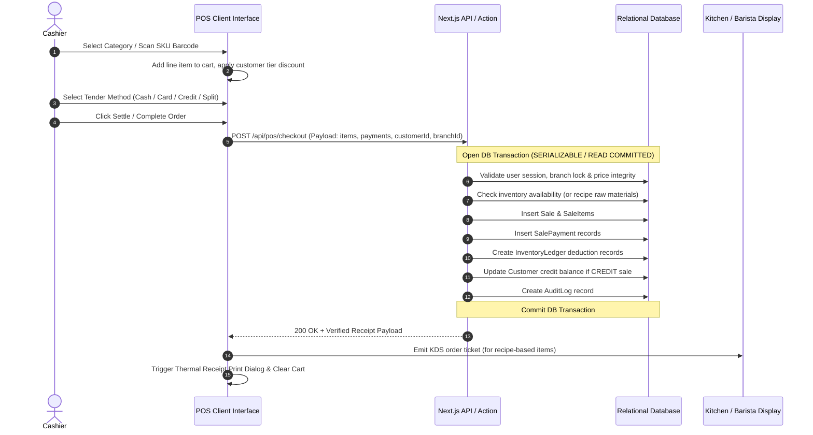

# NEXUSPOS Product Requirements Document (PRD)

**Product Name:** NEXUSPOS Enterprise Point of Sale & Retail Management Suite  
**Document Status:** Approved Architecture Baseline  
**Version:** 1.0.0  
**Target Platform:** Web (Desktop, Tablet, Mobile Responsive POS)

---

## 1. Product Vision & Executive Summary

NEXUSPOS is a cloud-native, multi-branch Point of Sale (POS) and inventory management platform designed specifically for fast-paced retail, hospitality (food & beverage / café), and wholesale businesses. It unifies frontline sales registers, recipe-based kitchen production, multi-location warehouse logistics, purchasing, automated inventory ledgers, customer relationship management (CRM), and workforce administration into one cohesive, lightning-fast system.

### Core Value Proposition
- **Cashier Velocity:** Sub-second barcode scanning, category switching, touch-first cart modifications, and split-tender checkout.
- **Relational Integrity:** Immutable ledger-based inventory movements, transactional checkout with zero risk of negative phantom stock, and auditable financial entries.
- **Unified F&B and Retail Support:** Native support for Bill of Materials (BOM) recipes, raw ingredient deduction, dining table floor plans, and Barista/Kitchen Display Systems (KDS).
- **Multi-Branch Isolation:** Strict multi-tenant and branch-level scoping, preventing unauthorized data access while aggregating organization-wide intelligence.

---

## 2. Target User Personas & Roles

| Persona | Role | Primary Goals & Responsibilities | Key System Touchpoints |
|---|---|---|---|
| **Alex (Store Cashier / Barista)** | `CASHIER`, `BARISTA` | Process walk-in customer orders at maximum speed, handle split payments, accept cash/cards, issue receipts, hold/recall orders, manage shift register cash. | `/pos`, `/pos/shift`, `/pos/held-orders`, KDS Modal |
| **Priya (Store Manager)** | `MANAGER` | Supervise daily shift reconciliation, approve refunds, void errors with PIN authorization, monitor stock alerts, adjust prices/discounts, oversee staff attendance. | `/dashboard`, `/sales`, `/products/*`, `/returns/*`, `/hr/*` |
| **Rohan (Inventory & Purchasing Officer)** | `INVENTORY_MANAGER`, `PURCHASING_OFFICER` | Manage suppliers, issue purchase orders, receive goods against POs (GRN), capture batch/expiry data, initiate stock transfers between warehouses, perform cyclic counts. | `/purchase-order/*`, `/grn/*`, `/products/inventory`, `/products/batches`, `/warehouse/*` |
| **Samantha (Financial Controller / Accountant)** | `ACCOUNTANT` | Reconcile daily sales, analyze product margins, track supplier/customer credit ledgers, calculate statutory payroll deductions, export tax and audit reports. | `/reports/*`, `/sales`, `/customers/transactions`, `/hr/payroll` |
| **Malik (Enterprise Owner / Admin)** | `ADMINISTRATOR`, `OWNER` | Maintain branch network, configure tax regimes, grant granular employee permissions, view organization-wide consolidation KPIs, oversee system integrations. | `/permissions/*`, `/settings`, `/admin/audit-logs`, `/dashboard` |

---

## 3. Core Operational Workflows

### 3.1 Frontline Point of Sale (POS) Workflow

### 3.2 Purchasing & Goods Receiving Workflow (GRN)
1. **PO Generation:** Purchasing officer drafts Purchase Order with supplier items, quantities, and expected unit costs (`/purchase-order/create`).
2. **Approval:** Manager reviews and approves the PO (`STATUS: APPROVED`).
3. **Goods Receiving:** Warehouse staff inspects incoming shipment, enters actual received counts, records manufacturer batch numbers and expiration dates (`/grn/create`).
4. **Atomic Inventory Crediting:** On GRN submission, the database increments warehouse stock, creates batch records, logs immutable `PURCHASE_RECEIPT` movements in the inventory ledger, and creates an accounts payable record.

### 3.3 Return & Refund Verification Workflow
1. **Lookup:** Cashier inputs original receipt/order number into `/returns/customer`.
2. **Validation:** Server verifies the order exists, items have not already been fully refunded, and time window is valid.
3. **Item Selection & Condition:** Cashier selects return quantity, reason code, and specifies whether the item is returnable to stock or written off as damaged.
4. **Restock & Settlement:** Transaction creates a `Return` and `Refund` record, reverses customer credit or issues cash/card refund, updates inventory ledger (if restocking), and logs an audit event.

---

## 4. Functional Requirements

### 4.1 Sales & Cashiering
- **FR-01 (Catalog Search):** Sub-100ms real-time search across product name, SKU, and barcode.
- **FR-02 (Cart Math):** Strict rounding to 2 decimal places using fixed-point integer cents/cents math to prevent IEEE 754 floating-point errors.
- **FR-03 (Split Payments):** Support multiple tender types on a single invoice (e.g., Rs. 2,000 Cash + Rs. 3,500 Card).
- **FR-04 (Order Parking):** Hold active carts with a customer or table label and retrieve them at any time without losing items or applied modifiers.
- **FR-05 (Manager Overrides):** Require a 4-digit manager PIN for price overrides, manual discounts exceeding 15%, line item voids, or cash drawer manual opens.
- **FR-06 (Register Shift Tracking):** Record opening float, ongoing cash drops/payouts, and closing count with over/short reconciliation report.

### 4.2 Inventory & Warehouse
- **FR-07 (Double-Entry Ledger):** Every stock delta MUST generate a row in `InventoryLedger` with `movementType`, `quantity`, `referenceId`, `userId`, `branchId`, `previousStock`, and `newStock`.
- **FR-08 (Negative Stock Prevention):** Block POS completion if stock is insufficient unless `allowNegativeStock` is explicitly enabled in branch settings.
- **FR-09 (Batch & Expiry Management):** Allocate stock according to FEFO (First-Expired, First-Out) or FIFO rules, flagging batches approaching expiry within 30/60/90 days.
- **FR-10 (Recipe / BOM Deductions):** Selling a composite product (e.g., "Cappuccino Large") automatically deducts underlying raw materials (coffee beans, fresh milk, sugar) according to the active recipe formula.

### 4.3 Customer CRM & Loyalty
- **FR-11 (Customer Profiles):** Track complete contact details, tax ID, assigned customer group, credit limit, and lifetime spend.
- **FR-12 (Tiered Discounts):** Customer groups automatically apply configured discount percentages at POS checkout.
- **FR-13 (Credit Accounts):** Block credit sales if an order exceeds the customer's available credit balance.

### 4.4 Financial Reports & Business Intelligence
- **FR-14 (Real-Time Aggregations):** All 18 report pages MUST query live transactional data with parameterized filters (Date Range, Branch, Cashier, Category, Payment Method).
- **FR-15 (Data Export):** Support one-click CSV and printable PDF generation for all financial and inventory reports.

---

## 5. Non-Functional Requirements (NFRs)

- **NFR-01 (Performance):** Page initial load under 1.5s on desktop (Lighthouse score >= 90); POS search responses under 50ms.
- **NFR-02 (Security):** Zero plain-text passwords (bcrypt with salt rounds >= 12); HTTP-only, `Secure`, `SameSite=Strict` session cookies; CSRF protection; rate limiting on authentication routes (max 5 failed attempts per 5 minutes per IP/user).
- **NFR-03 (Data Isolation):** All SQL queries enforce `tenant_id` and `branch_id` from verified server session context, preventing Insecure Direct Object References (IDOR).
- **NFR-04 (Reliability & ACID Compliance):** All financial checkout, inventory adjustments, and GRN receiving executed in atomic database transactions (`SERIALIZABLE` or `READ COMMITTED` with row locks).
- **NFR-05 (Accessibility):** WCAG 2.1 AA compliance, high contrast text ratios, full keyboard tab order in POS cart and cashier checkout dialogs.

---

## 6. Acceptance Criteria Matrix

| Feature | Acceptance Criteria |
|---|---|
| **User Login** | Given valid credentials, user receives an HTTP-only session cookie and is redirected to `/dashboard` or `/pos`. Given invalid credentials, return 401 with generic error without disclosing username existence. |
| **POS Checkout** | Given a cart with 3 items, when cashier tenders payment, server recalculates totals, verifies product prices against DB, updates stock ledger, records sale, and returns receipt object. If DB error occurs, zero changes persist. |
| **GRN Receiving** | When warehouse staff submits GRN with received items and batch numbers, inventory records immediately reflect increased quantity and batch ledger records are generated. |
| **Sales Report** | When user selects a date range from 2026-09-01 to 2026-09-20, report displays exact sum of all `COMPLETED` sales in that window, deducting discounts and detailing taxes. |
